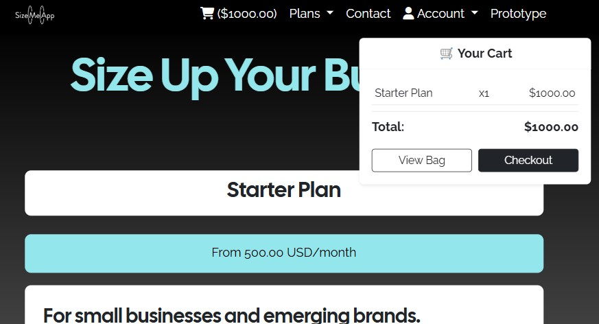
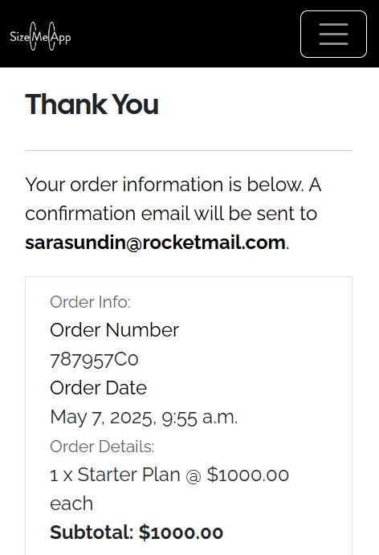

# TESTING
- [User Story Testing](#user-story-testing)
- [Lighthouse](#lighthouse)
- [Validation](#validation)
- [Bugs and Fixes](#bugs-and-fixes)

## User Story Testing

### User Story – New Customer Account Registration  
As a new customer, I want to register an account so that I can save my body measurements and try the application.

To ensure that the account registration process is intuitive, functional, and secure, the following tests were used to validate the feature.

#### Browser used – Google Chrome, Safari, Firefox, Samsung Internet  
- Form Accessibility – Confirmed that the registration form is accessible from both the navbar and login page.  
- Field Validation – Verified that empty fields trigger appropriate error messages and invalid formats (e.g. email) are caught.  
- Password Handling – Ensured passwords are securely hashed and not exposed in any templates or logs.  
- Measurement Requirement – Tested form logic to require measurements for users to enter size mode and receive recommendations.  
- User Creation – Checked that submitted data is correctly saved to the CustomUser model and visible in the admin panel.  
- Redirect Flow – Verified that users are redirected to the correct location after registration, including preservation of next if coming from a product page.  
- Mobile Responsiveness – Confirmed the form displays and functions properly on smaller screens.  
- User Feedback – Informal tester feedback indicated the form was clear, intuitive, and aligned with user expectations.

This feature meets the user story goal by providing a clean and functional way for new customers to register and access the core functionality of SizeMeApp.

### User Story – Personalized Size Recommendations for Logged-In Users  
As a logged-in user, I want to see size recommendations so that I choose the best-fitting garment and decide if SizeMeApp is right for my business.

To ensure that the feature provides useful, accurate, and accessible recommendations, the following user story tests were conducted:

#### Browser used – Google Chrome, Safari, Firefox, Samsung Internet  
- Size Mode Activation – Verified that users can activate size mode from the navbar and receive confirmation via a modal.  
- Measurements Handling – Confirmed that size recommendations are only shown when the user has submitted valid body measurements (chest, waist, hips, shoulders).  
- Recommendation Accuracy – Tested various user profiles and garment fits to ensure appropriate labels ("Perfect", "Tight", or "Loose") are displayed per size.  
- Modal Prompts – Verified that users without saved measurements are prompted to add them via a modal dialog and redirected appropriately.  
- Measurement Updates – Confirmed that users can update their measurements directly from the product page and receive success feedback.  
- UI Consistency – Ensured the list of recommended sizes appears clearly styled and easy to interpret within the product detail layout.  
- Accessibility – Checked that recommendations and modal interactions are fully navigable via keyboard and screen reader-friendly.  
- Mobile Responsiveness – Tested layout and readability of recommendations on multiple screen sizes.
- Login Prompt Clarity – Verified that the messaging explains the benefit of logging in to access personalized size recommendations.  
- CTA Visibility – Ensured the “Log in to see size recommendations” button is prominent, styled consistently, and redirects to the login page with next parameter preserved.  
- Login Flow – Confirmed that after logging in, users are returned to the product detail page and can immediately see recommendations if measurements are stored.  
- User Understanding – Collected informal feedback to confirm that guest users understood what size mode offers and why logging in is necessary.

This feature successfully meets the user story criteria, enabling logged-in users to receive tailored fit suggestions and evaluate the usefulness of SizeMeApp for their needs.

### User Story – Add a Plan to the Cart for Future Purchase  
As a user, I want to add a Plan to my cart so that I can buy it later.

To ensure that subscription plans can be stored and managed in the shopping cart, the following user story tests were conducted:

#### Browser used – Google Chrome, Safari, Firefox, Samsung Internet  
- Add to Cart Button – Verified that the “Add to Cart” button is visible and functional on each Plan detail page.  
- Cart Logic – Confirmed that each plan added is stored in the session under a custom cart structure separate from products.  
- Plan Detail Rendering – Ensured that the correct plan information (name, price, description) is displayed in the cart view.  
- Unique Plan Handling – Verified that only one plan can be added at a time and duplicates are not permitted.  
- Redirect Flow – Tested that users are redirected correctly back to the plan detail after adding a plan.  
- Session Persistence – Ensured that plans remain in the session-based cart when navigating away or refreshing the browser.  
- Clear Cart Option – Verified that users can remove the selected plan and the cart state updates accordingly.  
- UI Feedback – Confirmed that a minicart is displayed as visual feedback to notify the user that a plan has been successfully added.  
- Accessibility – Checked that cart controls and plan descriptions are screen reader-friendly and fully keyboard-navigable.  
- Mobile Responsiveness – Tested that the “Add to Cart” interaction and cart summary page display correctly across mobile devices.  
- Recursion Bug Regression – Retested after fixing a prior RecursionError to ensure no circular rendering or crashes occur when adding a plan.

This feature successfully meets the user story criteria, allowing users to add a subscription plan to their cart and complete the purchase at a later time.

### User Story – Secure and Streamlined Plan Checkout  
As a business owner, I want to complete my purchase easily and securely so that I can subscribe to a Plan and start using SizeMeApp.

To ensure that the checkout process is clear, secure, and successfully stores purchase data, the following user story tests were conducted:

#### Browser used – Google Chrome, Safari, Firefox, Samsung Internet  
- Form Rendering – Verified that billing fields and plan summary are displayed clearly on the checkout page.  
- Field Validation – Confirmed that missing or invalid entries trigger appropriate error messages.  
- Payment Integration – Tested Stripe integration to ensure tokens are created, processed, and confirmed securely.  
- Successful Order Flow – Verified that the user can complete the payment and is redirected to an order confirmation page.  
- Order Persistence – Ensured that completed orders are saved to the database and linked to the logged-in user.  
- Session Clearing – Confirmed that the session cart is cleared after successful checkout to avoid duplicate charges.  
- Payment Failure Handling – Tested failure scenarios (e.g. declined card) and confirmed clear error messages appear.  
- Mobile Responsiveness – Ensured that the checkout form and payment fields are usable on smaller screens.  
- Security Checks – Verified HTTPS enforcement and secure handling of user and payment data throughout the flow.

This feature successfully meets the user story requirements, allowing business users to complete a secure purchase of a Plan and begin using SizeMeApp.

### User Story – View Full Product Details 
As a user, I want to view full product details so that I can browse products and get size recommendations.

To ensure that product detail pages are informative, functional, and integrated with personalized features, the following user story tests were conducted:

#### Browser used – Google Chrome, Safari, Firefox, Samsung Internet  
- Product Detail Access – Verified that clicking on a product from the shop or search results navigates to the correct product detail page.  
- Product Information – Confirmed that each product page displays the name, image, price, description, and category clearly.  
- Size Mode Awareness – Checked that the interface updates based on whether the user is in size mode (e.g. recommendations shown or prompts displayed).  
- Size Recommendations – For logged-in users with measurements, verified that recommended sizes appear along with fit labels like "Perfect", "Tight", or "Loose".  
- Add Measurements – For users without measurements, confirmed that a clear prompt and modal allow them to add or update body data directly.  
- Login Requirement – Verified that guest users are prompted to log in before seeing size recommendations and are redirected properly after login.  
- Add to Cart Flow – Ensured that size selection and quantity inputs work and that clicking “Add to Cart” opens the prototype info modal.  
- Modal Interactions – Confirmed that modals for size mode entry, measurements, and prototype notices behave as expected.  
- UI and Layout – Checked that all product details are styled consistently and responsive across devices.  
- Accessibility – Ensured all buttons, modals, and dynamic elements are accessible via keyboard and screen reader.

This feature successfully meets the user story criteria, giving users a complete and dynamic product viewing experience enhanced by personalized sizing data.

## Lighthouse
I have recorded the first and final run with Lighthouse for all pages with images and warning messages below. 

### Home Page

#### First run with Lighthouse - Home page

### Plan Page

#### First run with Lighthouse - Plan page

### Bag Page

#### First run with Lighthouse (Bag page)

Improvement messages: 
- Buttons do not have accessible names.
- Form element do not have associated label.
- Heading elements are not in order.
  
#### Second run with Lighthouse (Bag page) - after fixing the issues.

### Checkout Page

#### First run with Lighthouse (Checkout page)
Overall Stripe gave me warnings and third party cookies I could not remove so I included one run with Lighthouse where Stripe is disabled.

Improvement messages: 
- Stripe inserts aria-hidden = true on card field.
- 14 third party cookies with stripe.
- Country select field missing label.
- Headings not in order.
  
#### Second run with Lighthouse (Checkout page) - after fixing the issues.

### Signup Page

#### First run with Lighthouse - Signup page

### Login Page

#### First run with Lighthouse - Login page

### Dashboard Page

#### First run with Lighthouse - Dashboard page

### Shop Page

#### First run with Lighthouse - Shop page

### Products Page

#### First run with Lighthouse (Products page)

Improvement messages: 
- Select sorting field missing label.
  
#### Second run with Lighthouse (Products page) - after fixing the issues.

### Product Detail Page

#### First run with Lighthouse (Product Detail page)

Improvement messages: 
- Buttons do not have accessible names.
- Form element do not have associated label.
- Select element do not have associated label.
- Size mode button in navbar not a list element.
  
#### Second run with Lighthouse (Product Detail page) - after fixing the issues.

## Validation

### W3C HTML Validator
I have included screenprints of the first and final validation of the HTML with W3C validation.
 

#### Home Page HTML- Initial Check

  
  
#### Home Page HTML- Final Check

  

#### Plans Page HTML- Initial Check

  

#### Signup Page HTML- Initial Check

  
  
#### Signup Page HTML- Final Check

  

#### Login Page HTML- Initial Check

  

#### Dashboard Page HTML- Initial Check

  

#### Shop Page HTML- Initial Check

  
  
#### Shop Page HTML- Final Check

  

#### Products Page HTML- Initial Check

  

#### Product Detail Page HTML- Initial Check

  
  
#### Product Detail Page HTML- Final Check

  

### W3C CSS Validator
The CSS was succesfully validated for all pages.

### JSHint Validator
I have included screenprints of all final validation for each script validated with JSHint.

#### Base.js - JSHint Check

#### Accounts - JSHint Check

#### Delete Account - JSHint Check

#### Mini Cart - JSHint Check

#### Products - JSHint Check

#### Shopping Bag - JSHint Check

#### Checkout Stripe - JSHint Check

#### Toggle Password - JSHint Check

### CI Python Linter
The CI Python Linter helps ensure that our code is clean, maintainable, and error-free, improving the overall development workflow and reducing potential bugs before deployment.

It implements:
- Automatic Code Checks – The linter runs automatically when code is pushed to the repository.
- PEP 8 Compliance – Ensures that the code follows Python’s official style guide.
- Error & Warning Detection – Identifies syntax errors, unused imports, and other common issues.
- Consistent Formatting – Helps enforce standard formatting, reducing unnecessary code style variations.

Tools used:
- Flake8 – Checks for syntax errors, style violations, and undefined variables.
- Black – Automatically formats code to follow best practices.
- Pylint – Provides detailed code analysis and improvement suggestions.

I ran all my Python code through the Python Linter with the following results. The final check for all code files were without errors. For more images tested on all apps see the [Read Me Images](documents/images_readme) folder.

### Example Testing - Accounts App

#### Accounts forms.py- Initial Check

#### Accounts forms.py- Final Check

## Bugs and Fixes
Here I have recorded some issues that I spent excessive time solving with the solutions indicated below.

### Bug: Multiple Modals Opened Simultaneously on ***product_detail*** Page

#### Description
When visiting the ***product_detail*** page, multiple Bootstrap modals (update size mode modal and prototype info modal) were opening at the same time when opening one or the other.

#### Root Cause
The bug was caused by multiple window.onload assignments in the postloadjs block of the template. Each modal trigger script defined its own window.onload function, which overwrote the others and led to unpredictable behavior where more than one modal could appear.

#### Resolution
The solution involved consolidating modal logic into a single window.onload function and using  / ` logic to ensure only one modal is triggered based on context flags passed from the view.

### Bug: AWS Storage Misconfigured

#### Description  
During setup of image uploads to Amazon S3, images were not being uploading at all, just the link to the bucket was cofigured.

#### Root Cause  
The problem was caused by the deprecation of the DEFAULT_FILE_STORAGE settings in versions Django 4.2 and newer. After this Django introduced the STORAGES setting for configuring storage backends. Continuing to use the old format led to Django falling back to default file storage or silently failing to connect to the S3 bucket.

#### Resolution  
The settings were updated to the new STORAGES format as recommended in the Django documentation:

### Bug: Checkout Fields Not Saving to CustomUser When "Save Info" Box Was Checked

#### Description  
After adding new fields (e.g. phone_number, address, city, postcode, country) to the CustomUser model, the checkout form did not save the details when the user checked the “Save this information for next time” box. The form submitted successfully, but the saved values were not persisted to the user profile.

#### Root Cause  
The checkout logic was originally designed for a default OrderProfile model. After extending CustomUser, the code handling the "save_info" flag was not updated to write to the corresponding fields in the custom user model. As a result, the posted data was ignored.

#### Resolution  
Updated the checkout view logic in checkout/views.py to correctly reference and save the new fields to the request.user instance when save_info is set to True.

### Bug: `RecursionError` When Adding a Plan to the Bag

#### Description  
When a user attempted to add a Plan to the shopping bag, the app crashed with a RecursionError: maximum recursion depth exceeded. This occurred during rendering of the plan_detail page after the item was added to the bag.

#### Root Cause  
The error was caused by circular logic between the plan_detail view, the bag system, and the page rendering. A template tag  was triggering the view recursively during template evaluation.

#### Resolution  
The bug was resolved by identifying and removing the recursive call chain. This involved:
- Reviewing all template tags and context variables that pointed to plan_detail.
- Ensuring that redirects, reverse(), or includes did not re-invoke the view.
- Refactoring plan_detail to avoid loading templates or partials that included self-referential links.

[Back to Content Table](#content)